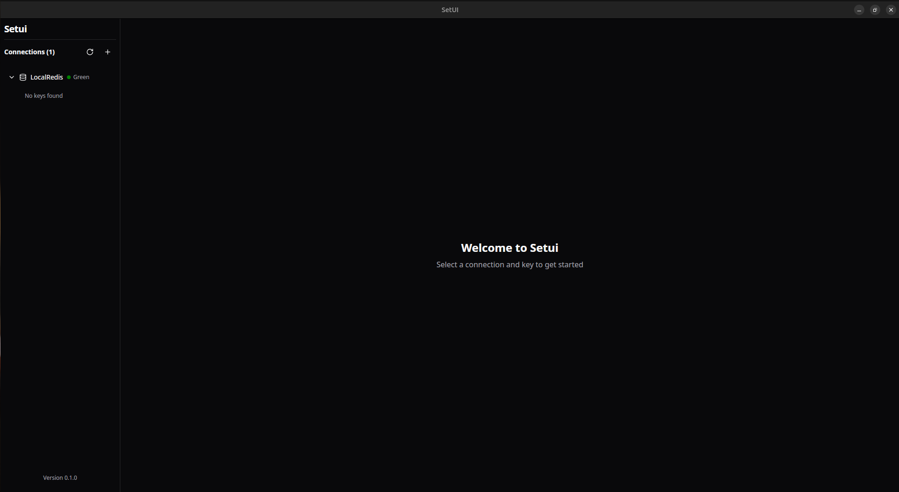
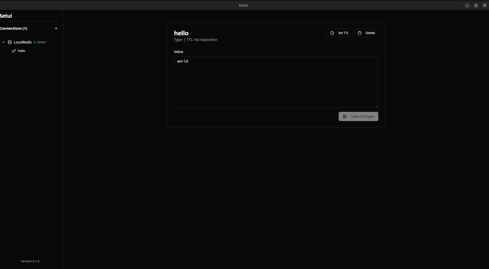

# Setui - Redis GUI Manager

A modern, fast, and user-friendly Redis GUI client built with Tauri, React, and Rust.




## Features

- Multiple Redis connection management
- Color-coded connections for easy identification
- Key pattern search and filtering
- Support for all Redis data types (string, list, set, hash, zset)
- TTL management
- Real-time key value editing
- Persistent connection storage
- Cross-platform support (Windows, macOS, Linux)

## Tech Stack

### Backend
- Rust
- Tauri
- Redis (via redis-rs)
- SQLite (via rusqlite)

### Frontend 
- React
- TypeScript
- Zustand (State Management)
- React Router
- shadcn/ui Components
- Tailwind CSS

## Development Setup

1. Install dependencies:
   ```bash
   # Rust dependencies
   curl --proto '=https' --tlsv1.2 -sSf https://sh.rustup.rs | sh
   
   # Node.js dependencies
   pnpm install
   ```

2. Run in development mode:
   ```bash
   pnpm tauri dev
   ```

3. Build for production:
   ```bash
   pnpm tauri build
   ```

## Architecture

### Backend Structure
- `RedisManager`: Handles Redis connections and operations
- `SqliteManager`: Manages persistent storage of connection details
- `Connection`: Data model for Redis connection information

### Frontend Structure
- React components for UI
- Zustand store for state management
- React Router for navigation
- Custom hooks for window management

## Features Documentation

### Connection Management
- Create new Redis connections with custom names and colors
- Store connection details securely
- Connect/disconnect from Redis servers

### Key Management
- Browse keys with pattern matching
- View and edit key values
- Set/update TTL
- Delete keys
- Support for different Redis data types

## Contributing

1. Fork the repository
2. Create a feature branch
3. Submit a pull request

## License

MIT License

## Support

Create an issue in the repository for bug reports or feature requests.